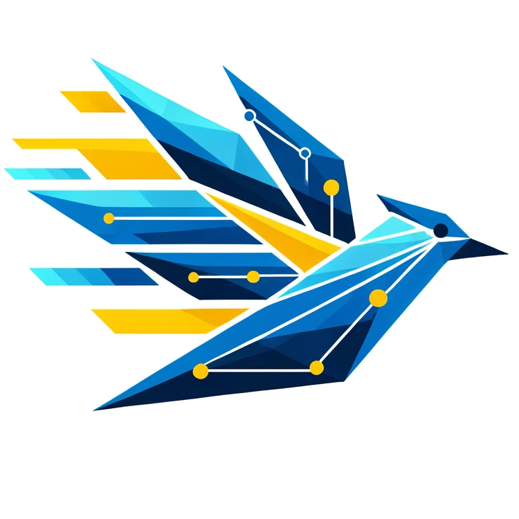
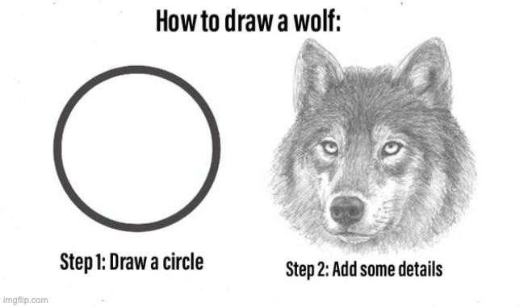

OpenTelemetry can be a difficult project to describe to people, because the gap between what it is today and what it _will_ be tomorrow is very large. It's easy to stare at it from a distance, squint your eyes, and wonder what the hell we're doing over here. The further away you are from the core contributors, maintainers, and weird little observability guys at the center of it all, the harder it is for things to come into focus. There's a few reasons for that, one of which is that I truly think that it isn't a completely shared vision (and that's ok, for reasons I'll get into) -- but the biggest is that the vision really is just that. A _vision_, one that is going to take years to realize. That vision is what should excite people, but because we're not great at selling it or even describing it, it winds up turning people away.

<!--more-->

So, before I continue, I want to disclaim a few things. First, I am not writing this in an official capacity as an OpenTelemetry maintainer, governance member, etc. These are my personal opinions, retweets do not constitute endorsements, etc.  

The inspiration for this post was a combination of reading [this HN thread](https://news.ycombinator.com/item?id=38971178) and the work that I've been doing to finish up [Learning OpenTelemetry](https://learningopentelemetry.com). Part of the challenge of writing this book has been something that we admit pretty early on; Telemetry, by itself, is **worthless**. Having a bunch of datapoints, no matter how semantically beautiful or accurate they are, is about as helpful as a cat on a keyboard. Nice to look at, but it's hard to get any work done. How do you write a book about observability where you can't really talk about the _observability_ part, then? You'll have to buy the book to find out, but a lot of it comes down to telling you why the telemetry matters so much. It's necessary, but not sufficient, for observability.

## Where does OpenTelemetry shine?

To that end, let me commit a cardinal sin as both an open source advocate and a competitor; I think Datadog is really good. Do you know why? Because they've made it really easy for people to feel like they're 'doing observability'. You don't have to be an expert to install their agent and pop in a few includes to get dashboards and alerts that are genuinely helpful and mostly easy to use. I also think New Relic deserves a callout here as well, along similar lines -- if you just want to see what the hell is going on in your application or system, they've made that process about as elegant and streamlined as you can imagine. When I was a wee bairn, dipping my toes into monitoring, I started out with both of these tools because they're remarkably effective at _making you feel like you're doing observability_.

There's a difference between vibes and results, though, and this is where I think those products tend to start falling apart. If the defaults don't work, and as your system gets more complex, your needs start to change. Pareto effects start to mount, and suddenly you're paying tens of millions a year for things that _kinda_ do what you want most of the time and working around the gaps. There's stuff you'd like to do, but it's not cost effective, so you're stuck with what you're given.

This is the pain point that OpenTelemetry solves _today_, for the most part. Sure, there's a lot of gaps between what's specified and what's implemented in many languages, but you can look at something like [OpenTelemetry Java Instrumentation](https://opentelemetry.io/docs/instrumentation/java/automatic/) and see what's possible. A single agent that gives you metrics, logs, and traces with strong correlation and context between telemetry signals, compatible with dozens of vendors and open source analysis tools, and a collection ecosystem that offers a lot of customization and processing options. I don't think it's a bridge too far to ask you to imagine what that looks like in other languages, or for other architectures. I also don't want to dismiss this in any way; This is a pretty big deal. There's a lot of value in having an 'easy button' for getting this telemetry data out of your applications in a streamlined way.

Telemetry, though, is necessary but not sufficient.

## "Drawing The Rest Of The Owl"

Perhaps you're familiar with this category of meme about drawing an owl, or a wolf, or whatever animal. It's a two-step process, where the first is to draw a basic shape, then the rest of the process is left as an exercise to the reader. If you've tried to actually set up an observability practice, it probably resonates with you that while there's a ton of documentation and setup guides on how to draw a circle, there's very little out there on how to add the details... and there are so many devils lurking in those details, dear reader.

These details are where tools like Datadog and New Relic tend to shine. It's one thing to have a great out of the box install experience, but that in and of itself only gets you so far. Where they excel is that once you install those agents and get data flowing, you get a bunch of dashboards that give you helpful, and actionable, details about performance. They even color-code things! Grafana is also getting better and better at this by leveraging their strength in the open source world, crowdsourcing dashboards for all sorts of software and tools (over 74 pages, I just looked).

We do ourselves as an industry a disservice by waving away this prior art. People wouldn't make this stuff, or use it, if it didn't actually help them. Let's take it as a point of fact that it does, and that a lot of people are generally pretty happy with what they have today.

_However...._

Accepting that forces us to grapple with the popularity of OpenTelemetry. What I've seen over the past few years is a curious change in the market. Rather than vendors having to advocate -- grudgingly, in some cases -- for OpenTelemetry, people are starting to adopt it on their own. The word 'strategic choice' gets thrown around a lot. Some of this is due to a sense of inevitability, sure, but quite a bit is because of what I pointed to earlier; In popular languages, it really is _good enough_, and the fact that it's vendor agnostic is a huge point in its favor. OpenTelemetry, from that perspective, has managed to consolidate most of the pretty good ideas we've had over the past ten years or so, bundle them up into a single package, and ship it. That's great! It's a lot harder than you'd think, and we're by no means done, but it deserves recognition for what it is.

What needs to happen next, though, is something different, and it's something that isn't going to come from OpenTelemetry itself. It's got nothing to do with query languages, or sampling, or management planes... well, nothing to do with those _specifically_.

## The Rest Of The Owl

There's a bunch of tools that accept OpenTelemetry, but there's none that are really 'OpenTelemetry Native'. I'd argue that there's a few that are approaching that but as of now, I'm not aware of anyone that has really stepped back and started from first principles, nor do I think we're going to see one for several years. Why? Well, hell, the thing isn't even done-done yet. Maybe once we start hitting 1.0 in more things.

This does leave people in kind of a shitty situation, though. Trying to shove OpenTelemetry data into non-OpenTelemetry data stores usually means you're gonna have a bad time. Someone in that above HN thread was talking about how AWS charges per tag on metrics? That's a decision. I know that the reason most existing tools charge extra for 'custom metrics' is because they can do a bunch of memoization tricks for their default attributes to reduce costs, but c'mon, we've been working on semantic conventions for literal years and even the Prometheus people admitted they were the best thing about OpenTelemetry. It's not like y'all didn't see it coming.

This is the kind of stuff that keeps me up at night regarding OpenTelemetry, really. We can do a lot as a project to try and limit scope and build an effective, yet broadly customizable framework, for people to build on and for third party developers to integrate into their libraries and tools. The problem is, that's not the rubric which we get judged by. We get judged by the experience that you have when you try to send your OpenTelemetry data to Cloudwatch, or Datadog. We're judged by how much you hate your annoying coworker that was all-in on tracing and decided to 10x your telemetry volume by adding in function-level spans. We're judged by your ambivalence towards our documentation, or method naming conventions, or whatever story you've spun about how we're not idiomatic for your particular language or tech stack. Some of these we can control as a project, some of them we can't. The ones that are the most damaging in the long run, though, are the ones that are entirely out of our control, and that's what worries me.

Don't get it twisted, I think there's still value in existing tools adopting OTLP and semantic conventions. If, after another five years, all we've done is make a pretty good set of conventions around telemetry data and how it should be ferried around I think I'll still be happy with the project.

But the vision is still gonna be out there. A vision that actually leverages our context layer, and uses it well. Sampling as a first-class, seamless part of your observability stack. Automatic routing of telemetry based on class and type, and query interfaces that work across disparate data stores. New types of visualizations, and timelines as a primary visualization for user journeys. There's so much that can be done, we just need to get there first.
