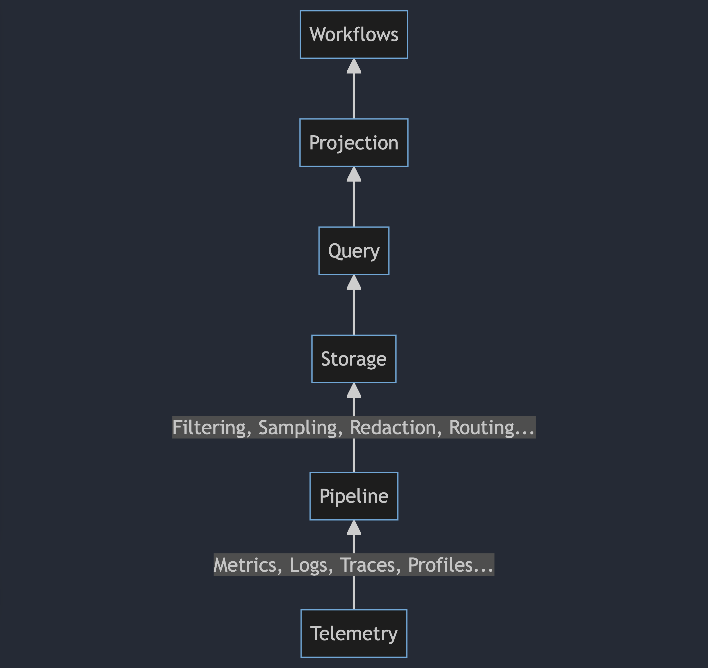

I used to joke that there were maybe fifty people on the planet that really cared about 'observability' at a philosophical level, and I still maintain that I'm mostly correct. Maybe you're one of them, but odds are, you aren't. This disconnect becomes very obvious when I look at the way that people prefer to use observability tools, and more specifically, the way that those tools build workflows on top of telemetry collection. In this post, I'm going to look at a few popular examples of this in the front-end space to draw some comparisons between the state of the art in OpenTelemetry vs. its incumbents.

<!--more-->

Let's get the boring stuff out of the way -- what's my criteria to include something in this comparison? Well, I'm going to mostly look at what's popular; Datadog, Sentry, and Rollbar. This is a bit web-focused, but by and large a lot of these tools wind up breaking down into the same general modalities. They capture errors, give you core performance measurements (like Core Web Vitals), and generally give you the ability to "see when things are going wrong". I'm also focusing on the web side of these, but I don't think there's really a huge difference between the experience of actually using it as a developer from an integration point of view.

I also wanna disclaim that I'm not a front-end dev, I'm just someone that cares about 'observability' as a concept. There might be things that seem weird to me that are obvious to people more ingrained in this space. With that said, let's walk through the setup process for each, and discuss what their SDKs do.

## Rollbar

[Rollbar](https://rollbar.com) is an observability tool that's focused on error tracking. They offer SDK's for a variety of platforms, but their focus appears to be mobile applications (iOS/Android) and web. Essentially, they're a logging platform -- you install their SDK, it hooks into exception handlers, and sends those exceptions and stack traces to their platform for alerting or discovery. They also support sending log messages directly to their platform, in addition to capturing telemetry data (such as request timings, etc.) in certain circumstances.

Configuration is fairly standardized across all language SDKs. You import a single package, and pass a config object to it that includes your account access token and some configuration settings. Behind the scenes, the SDK intercepts and rewrites method signatures on targeted objects such as XMLHttpRequest in order to create traces, or on the JS exception handlers to trap and forward unhandled exceptions and errors.

On the platform side, it appears that events are hashed as they're received in order to avoid storing every unique occurrence of an error or log message. The number of interceptors built into the SDK also means that errors can have various pieces of context embedded with them, everything from local variables to prior DOM events.

## Sentry

[Sentry](https://sentry.io) offers similar features to Rollbar, insofar as that it focuses on error recording. They also offer SDKs for a variety of platforms, including iOS, Android, and Web. The mechanism of action in Sentry is pretty similar to the Rollbar SDK -- you import a package, you pass some config options, it hooks various built-ins or other library functions, and it starts sending data.

There's not a ton of details about how Sentry actually processes and stores this data behind the scenes, although it appears that they're using tracing pretty heavily in their SDK in addition to head sampling (suggested defaults seem to be a 10% head sampling rate, with 100% sampling for errors). One interesting note about both Sentry and Rollbar is their documentation flows are very light on code; They get you into the tool very quickly, and a lot of the imputed value seems to come from connecting your codebase into their platform via integrations like source maps, or hooking into your GitHub/Jira.

One thing that's nice about Sentry is that they have a lot of other functions, all available through the same SDK. If you'd like to do session recording, you can do that. If you want to capture profiles, you can do that. You get a lot of stuff without having to work for it.

## Datadog

[Datadog](https://www.datadoghq.com/product/real-user-monitoring/) is a bit harder to quantify here, because it does a little bit of everything. All of Datadog's error tracking, session replay, and other 'client monitoring' tools are bundled up under their Real User Monitoring product. Like Sentry and Rollbar, they offer SDKs in a variety of languages targeting iOS, Android, and Web. Unique to Datadog is a... Roku SDK? Ok, sure?

Similar to the other tools in this list, installation of the SDK is very straightforward. Import a package, pass a config blob, set up your sampling options. Datadog provides a pretty complete end-to-end story for full stack observability as well, allowing you to link traces collected by the RUM library with back-end APM signals.

Again, the actual mechanism of action is remarkably similar to the prior tools. Interceptors rewrite method calls, etc. All of these tools work in pretty similar ways, truth be told. Looking at what Datadog offers, I'd actually give Sentry some points for UI and UX - it's not that Datadog is bad, I just find their UX to be somewhat overwhelming.

## What can we learn here?

There's a few commonalities you can tease out from looking at these three tools, and I think they're very interesting ones.

- None of these tools use open standards, really. Each of them is collecting data into a proprietary format, their APIs all have subtle differences, and even conceptually similar things will require you to learn a different dialect to use them (for example, adding custom attributes to events)

- They all pretty much do the _exact same thing_ in _mostly the same way_. There's no real innovation in terms of the underlying code here, it's all fairly commodity stuff. Hook into a bunch of standard library stuff and create some traces/logs, send 'em off.

- There's actually not a lot of differences in the ergonomics of _getting started_ with these tools, either. They all provide extremely straightforward and low-touch installation and configuration methods. Import a package from a CDN, or download and bundle it, do what you will. There's subtle differences in terminology or what the actual configuration options are, sure, but there's no real distinction.

- The goal of all of these tools -- based on what their documentation tells me -- is to get you into their SaaS and keep you there. They all want you to build development workflows that lead through their platform.

What's most curious about this is that the first three of these points are some of the exact same rationalizations we used in creating OpenTelemetry. If you think back, they're all fairly applicable to the state of the world several years ago. APM libraries for backend services were usually highly duplicative in terms of functionality, installation method, configuration options, etc. The nouns and verbs were different, but the actual behavior was pretty much the same. The way you used them was also pretty much the same, at that.

I don't really feel like the frontend space is that special or unique in this regard. It seems ripe for someone to come in on the back of the work that's being done in OpenTelemetry JS with the [web SDK](https://github.com/open-telemetry/opentelemetry-js/pull/4325) and build a really great UX on top of the data that it's going to send. I also tend to think that future releases of things like Flutter or React will wind up having native bridges to OpenTelemetry, making this even more of a moot point.

That said, I don't think we can necessarily wait for that to happen organically. I think there's a lot that OpenTelemetry can learn by looking at these existing tools and how easy it is to get started with them -- I'd love to see the project focus on these sort of ergonomics in 2024!
