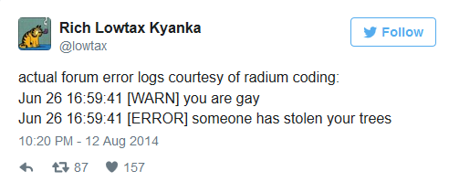
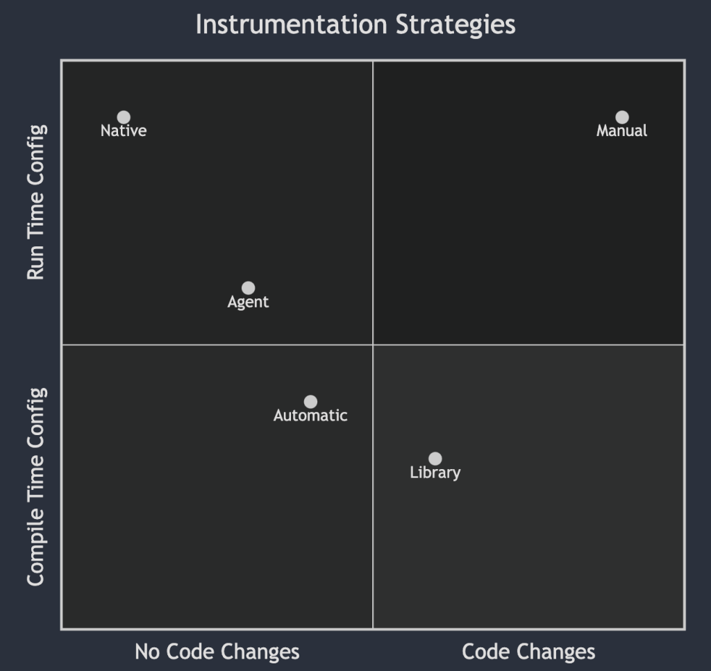

Ever asked ChatGPT about OpenTelemetry? There's a pretty good chance that what it spits out at you started out as something I wrote, years ago. When the project started, I picked up where I left off maintaining the docs and website for OpenTracing and built the first few versions of opentelemetry.io ([seen here in late 2019](https://web.archive.org/web/20191223060604/https://opentelemetry.io/)), including most of its initial documentation, concept pages, and so forth. Little did I realize then that the project would become as large as it did, or that everything I wrote would get repeated across the internet on dozens of other documentation sites, marketing pages, and blogs... and I really did not see those words getting fed into massive language models, thus ossifying a lot of the concepts that I wrote about into point-in-time snapshots of what a lot of words _mean_. One of these words, and the one I want to dive into, is **instrumentation**.

<!--more-->

## What is instrumentation for observability?

Let's start with some review. Instrumentation is code that you write in order to learn about the internal state of a program. The simplest form of instrumentation, and one that you've almost certainly done regardless of how long you've been programming, is writing out a message to the console. Yep, if you've written a `console.log` statement in your life, you've written instrumentation.

Like many things in programming, the complexity of instrumentation code ramps up very quickly. Writing out log lines to help you understand what functions are being called or what the value of a variable is at any given moment is easy enough, but it doesn't scale well. There's a cycle that tends to repeat itself in development, because the kind of instrumentation that's useful when you're prototyping something isn't necessarily the kind that's useful when you're running thousands of instances of it across hundreds of nodes. To address this, you would use some kind of instrumentation framework -- a logging library, for example -- that _structures_ your data into a schema, and attaches useful information to each message like the host or container name that your service is running on. This structured data can then be processed by machines more easily, converted into other formats, and so forth.

This sounds easy enough, right? Write a little code to tell other humans what your code is doing, add some structure to it, bing bong boom -- you've got observability. Or do you?

## The problem with instrumentation

Every line of code you write is debt, in a way. You're gonna pay for it in the end, one way or another. Instrumentation code is no different. What happens when someone refactors your program in order to make it perform better, or when the business logic subtly changes to handle edge cases or bugs? What guarantee do you have that those log statements you wrote actually make sense in the future?

While most people who program professionally don't have to deal with Radium-quality error messages, I've seen my fair share of inscrutable or completely incorrect log statements printed out by actual software that human beings pay real money for. The other tricky part of this is that instrumentation code isn't exactly exciting stuff. It can be tedious to write and maintain, it adds a lot of cruft to the actual legibility of your code blocks, and it's often load-bearing. Many teams will have log processors that convert log messages into metrics for long-term storage and analysis; Changing or removing log lines can break this functionality, which means you have to coordinate with whichever teams own the log pipeline in order to make things better, and they're probably busy with their own problems...

This is one of the reasons there's a lot of duplicate instrumentation in the world, this problem of joint ownership. The people who write the code will write instrumentation for them, the people who operate the systems will create their own instrumentation tailored to their needs, product managers and other business stakeholders will want their own unique instrumentation as well. Everyone wants to know what's up, but they work at cross purposes quite often when it comes to an instrumentation strategy! It's usually easier to just throw your hands up and throw something at the problem, and this is where we get into the magic of _automatic instrumentation_.

## The difference between instrumentation, instrumentation, and instrumentation.

If instrumentation is code that you write to understand the state of a program, why are there so many types? You may have read about agent-based instrumentation, or library instrumentation, or automatic instrumentation -- let's step back, and talk about the different approaches that you can use to instrument a program in the first place.

- You can write instrumentation code directly alongside your business logic and other code. This is known as 'white box instrumentation', or 'manual instrumentation'. In this approach, you're responsible for everything; You install and configure a telemetry API and SDK then write the instrumentation code yourself. This gives you the maximal control over what telemetry you emit, as well as what that telemetry contains.

- You can import libraries that wrap or plug in to your dependencies, and those libraries contain instrumentation code. This is sometimes referred to as 'library instrumentation', but can also be thought of as a form of white box instrumentation. You're still making changes to the code, but instead of writing all of the instrumentation yourself, you're relying on a third party to do most of the work. This approach is usually combined with some amount of manual instrumentation on your part -- you extend the instrumentation code provided by the library with additional attributes or specific telemetry about your program.

- You can use an external program or process that leverages instrumentation libraries and runtime modification to create instrumentation without code changes. This process can be referred to as 'black box instrumentation', 'agent based instrumentation', or 'automatic instrumentation'. The key distinction between this and the earlier examples is that you don't change your code at all. The agent uses reflection, interceptors, monkey patching, or other techniques to inject the instrumentation code into your program at runtime (or in some cases, at compile time).

- You can use an external program to hook into existing telemetry being generated from your library or runtime and send this data off for analysis and processing. This is also a form of 'automatic instrumentation' or 'agent based instrumentation', although it's somewhat of a misnomer since there's no real instrumentation happening -- the instrumentation itself is _native_ or built-in. This is in many ways the 'best' way of doing things, as it requires the least work on your part and provides a good balance between flexibility and telemetry resolution (since you can dynamically change what data you're collecting by modifying configuration values during runtime, often without interrupting your program execution)

If you look at these four options, you might notice a bit of a theme. They form a quadrant where we care about how much we need to change our code, and how we handle the configuration of instrumentation. The actual choice you make in terms of which strategy you'd like to apply is going to differ based on many different facts -- the size of your team, the needs of various stakeholders in the organization, systems access, and so forth. One of the challenges to navigate here, though, is that some of these strategies are incompatible with each other! If you're using an agent, then that agent is probably exclusive. An OpenTelemetry agent and a DataDog agent, for example, are going to conflict with each other in most cases, as they'll both try to instrument the same parts of your program in different, incompatible ways.

The attentive reader may have noticed that the actual words I'm using to describe these don't necessarily map to these axes super well. I don't think this is deliberate, or at least the intention isn't to be misleading, on anyone's part. The problem is that we're trying to cram multiple dimensions of meaning into as few letters as possible, and _anything_ you put in front of a long word like 'instrumentation' is likely to make people fall asleep from reading it. This is why OpenTelemetry's website has, for quite some time, consolidated these concepts pretty heavily. 'Instrumentation' is the top-level concept, with 'Manual' and 'Automatic' as sub-types. While this misses out on some nuance, that nuance wasn't judged to be terribly important at the time, as I recall.

Unfortunately, this approach _also_ has wound up causing some confusion!

## Instrumentation strategies differ based on your role

As I mentioned earlier in this post, there's a lot of people who care about instrumentation and telemetry data. They usually care about different slices of that data, at different resolutions, and have their own preferred ways to visualize or interpret it. This also means that different teams may own different data streams coming from a single program, or rely on a centralized observability team to convert existing streams (like combined server and application logs) into a variety of other formats (such as access logs being split to a security analysis tool, and application errors being converted to metrics + stack traces and funneled off somewhere else). I find in most organizations, though, the lines are a bit more blurry and multiple teams will wind up piecing together complex observability pipelines, often relying heavily on agents to instrument their software, because developers wind up writing logs that are useful for local development and not necessarily production monitoring.

So, what does this have to do with the words we use for these tools? Well, without a clear way to describe these approaches, we're finding it challenging to clearly communicate the expectations of OpenTelemetry to its users. The eventual goal of OpenTelemetry, again, is to make telemetry native -- built-in, without you having to write anything. _However_, even when it's built-in, you'll _still_ need to write instrumentation code to add more details. Even if your web framework and database clients are instrumented, you'll want to be able to easily add additional attributes and context to those transactions to help model your system.

To that end, there's a [discussion about how to refactor the OpenTelemetry documentation](https://github.com/open-telemetry/opentelemetry.io/discussions/3809) to better reflect how, why, and when you should use each type of instrumentation strategy. At a high level, we're trying to move away from using the word 'instrumentation' quite so much (because it's exhausting to write and read), and grouping instrumentation styles based on the question of 'do I have to write code for this or not?'

For SREs or operators who are really only interested in [instrumenting with our zero-code agents](https://github.com/open-telemetry?q=instrumentation&type=all&language=&sort=) in languages such as Java or .NET, this distinction makes it clearer where they should start. For developers who are modifying their programs to add instrumentation -- irrespective of how they're integrating it -- we'll be grouping this data under an 'API & SDK' section, split out by language. As OpenTelemetry gains adoption, we're seeing that this is a more relevant breakdown of how users expect to find this information.

## How should you instrument your application?

It's worth noting that the reason people wind up with different, competing forms of instrumentation in the first place is because everyone is just trying to do what offers the least friction for them. Developers are going to write logs, because that's the easiest thing to do. Logs give near-immediate feedback during development, and if you're just writing code and trying to understand the local behavior of code, they're great. The problem isn't that logs are bad -- it's that they're not sufficient inputs to an observability system. Logs + Metrics suffers from this problem as well; Restrictions on metric cardinality mean that it's hard or impossible to actually ask a good question from your system. The reason people harp on tracing so much is that it's a good way to split the difference here, but people often run into challenges deploying tracing at scale and avoiding over-sampling.

OpenTelemetry fixes a lot of these problems for us, long-term. Developers can write the telemetry they want to -- be it logs, metrics, traces, or whatever comes next -- and that same telemetry can be intelligently collected and used by ops teams, business analysts, or security operations. The de-coupling of the OpenTelemetry API and SDK means that library authors can write high quality traces, metrics, or logs for their code and ensure all of their users will be able to access it. Instead of having multiple competing instrumentation agents, a single OpenTelemetry agent will be able to collect multiple signals and emit them in a single, well-supported format.

The best news is, a lot of this is here today! If you're using Java, most of what I just described can be accomplished with the tools available to you now. .NET also supports a lot of this, and over the course of 2024, I expect a lot more languages will come on board as we stabilize more OpenTelemetry components.

Anyway, that's how (and why) we got to where we are when we talk about what instrumentation should be called. If you've made it this far, thanks for reading! If you read this and thought, "Wow, I would sure love to learn more about OpenTelemetry", then I invite you to check out my new book, [Learning OpenTelemetry](https://learningopentelemetry.com), which will be available this March. Pre-orders open now!
