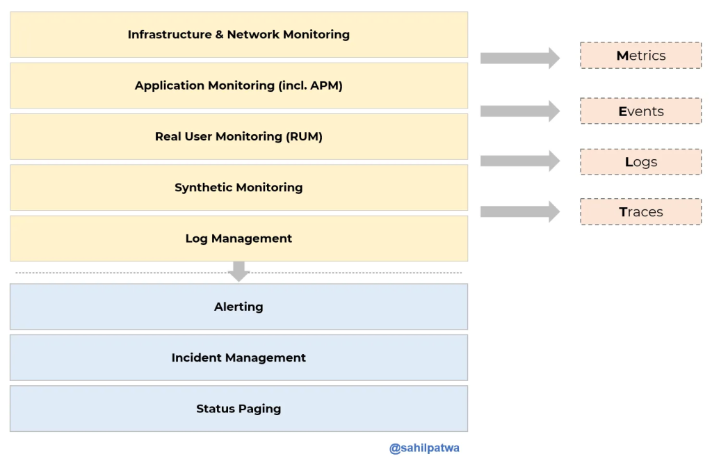
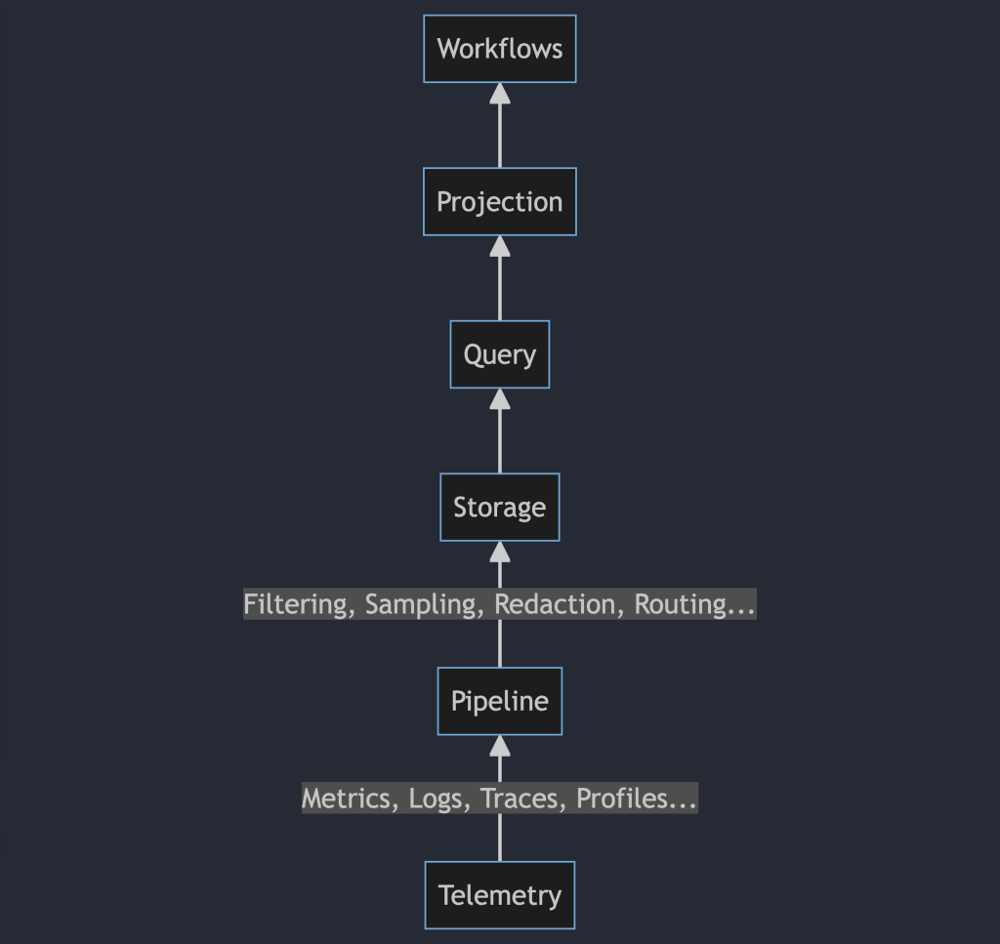

I'm motivated to write this post as a result of several discussions I've had over the past week or so prompted in part by the announcement of Elastic wanting to [donate their profiling agent](https://github.com/open-telemetry/community/issues/1918) to the OpenTelemetry project. One of the bigger challenges around OpenTelemetry is that you can think of it as a vector. It not only has a shape, it has a direction, and the way you think about the project and what it is has a lot to do with how well you understand that direction. There's the OpenTelemetry of yesterday, the OpenTelemetry of today, and the OpenTelemetry of tomorrow. Let's talk about each of these in turn, so that we can try and build a model of what OpenTelemetry _is_ in a holistic sense.

<!--more-->

## The OpenTelemetry of the Past

What was OpenTelemetry, from the outset? Casual observers may not be aware of the history surrounding the project, so I'll give a quick recap. OpenTelemetry was formed by the merger of two existing open source projects, OpenTracing and OpenCensus. While there were a decent amount of differences between the two, they both shared a similar goal -- to make distributed tracing more accessible to cloud-native software developers. The methods that each project used differed; OpenTracing provided a thin, vendor-agnostic interface around creating traces and propagating trace context, while OpenCensus provided an end-to-end API, SDK, and wire format for telemetry data.

To summarize, both OpenTracing and OpenCensus both envisioned a future where _telemetry was independent of analysis_, but got there different ways. OpenTracing had a core tenet that an interface-only design would be preferable, as vendors would not want to give up control over the telemetry SDK. OpenCensus assumed otherwise, but felt that metrics would still be core to the telemetry needs of developers and operators. We were all right, and wrong, about some of this. What's really interesting, though, is the stuff that OpenTelemetry does that _neither_ of OpenTracing or OpenCensus did. We'll get to that in a little bit.

Post-merger, OpenTelemetry's priority was in replacing the existing features of OpenTracing and OpenCensus. This is why, for instance, we focused on the tracing signal to the exclusion of others at first. In doing so, though, we incorporated a few really good ideas that would become prescient. The first is to build out standardized and consistent metadata across signals. These are known as the semantic conventions, and they provide a lexicon of attribute keys and acceptable values -- a schema -- for telemetry metadata. Through semantic conventions, telemetry not only becomes independent of analysis, but the skills required for analysis also become a commodity. In plainer terms, you don't need to re-learn what measurements mean what from system to system; Learn the semantic conventions, and you'll always know what something means, and if that something matters. The second really good idea we incorporated was the context layer. This is the part of OpenTelemetry that propagates a globally unique, per request identifier between each of your services. If these identifiers are present, other telemetry signals can be joined together by using this shared correlation ID.

## The OpenTelemetry of Today

OpenTelemetry remains a 'tracing tool' in a lot of people's minds; I think it's fair to say that a lot of this is due to its legacy as the child of two 'tracing frameworks', not to mention the relative maturity of the tracing functionality relative to, say, metrics or logs. That said, I think its important to look at what's actually available, and how you can use it.

The OpenTelemetry Collector is a fully-featured telemetry collection agent, capable of ingesting dozens of common event sources on Linux, MacOS, or Windows. It can receive or scrape metrics from Prometheus, StatsD, or through native metric receivers like `hostmetrics`. It's capable of translating existing trace data emitted by Jaeger, DataDog APM, Splunk, or many other sources into OpenTelemetry format. With the right tooling, you can even remotely configure and manage many hundreds or thousands of Collectors via OpAMP.

Want to get application telemetry? Cool, you can do that too -- zero-code instrumentation packages exist for Java, .NET, PHP, Python, and Node.JS. These packages will give you a pretty basic set of 'APM' spans (which you can even turn into just metrics if you'd like using the Collector), about what you'd see from a New Relic or DataDog APM package. Is it 1:1? No, of course not, but it's _pretty good_ and I'd argue that it's usually good enough to get started for most people. The biggest thing missing here is that most of these instrumentation packages are emitting just trace data and not metrics or logs yet, but it's coming, especially as metrics and logs continue to stabilize.

Heck, if you're in Java then you've got most of that already. You can configure log4j or whatever to append to an OpenTelemetry log sink and whammo, you've got nicely formatted OTLP logs that will get annotated with trace data if it's available. That's pretty slick!

I do want to note that yes, there are gaps. The ergonomics of installing and configuring OpenTelemetry could be a lot better, especially if you're doing more than just adding zero-code instrumentation. We made a lot of design decisions in OpenTelemetry to support it being a framework to build telemetry systems on top of, not necessarily for it to be a seamless experience to integrate directly. Perhaps that will change in the future -- honestly, it's kinda up to all y'all. I'm just one person on the governance committee. Open issues, ask for change, we'll listen. My door is always open (seriously, [book some time to talk](https://calendly.com/austin-hny/opentelemetry-office-hours)) and I'll guarantee that I'll do everything I can to help point you in the right direction.

That said, I'd still argue that OpenTelemetry as it stands today is _pretty good_, _most of the time_. We've done a decent job at encoding the state of the art for what's possible, today, in its design and implementation.

## The OpenTelemetry of Tomorrow

However, the point of OpenTelemetry isn't just to put a flag in the ground around what has already been done and say that this is good enough. I believe that to understand what is possible, and where we're going, we need to discuss the idea that telemetry is independent of analysis. Another way of saying this is that _telemetry is not observability_.

Telemetry data is foundational to observability practice, but the way most people conceive of observability doesn't really gel with it as an independent part of the stack. I'm going to illustrate this with an image from a [blog I read the other day](https://medium.com/investment-thesis/observability-n-0-cfb2e52c6324), talking about observability:

I find this image to be somewhat mysterious, to be honest, because it's kinda backwards. If I was going to redraw it, I would change things around slightly.

This may look strange to you, because it's a lot of stuff that you don't have to care about (unless you're building an observability system from scratch, in which case, I'm sorry) normally. If you're using DataDog, or New Relic, most of these details are elided. You install an agent, it does some magic, and you get these nice workflows that fall out of it. You can go into the tool, pull up a dashboard, and it tells you what's slow. You probably have to care about the query layer of this _somewhat_, but only in the sense that you need to understand the queries and visualizations they can generate in order to build workflows. Even so, a lot of this is work that's being done for you or has been done for you.

The problem with this model and existing tools is that a lot of them work specifically because they get to control this entire stack, and you only have to think about the actual workflows you care about. You want to know your slowest DB queries or find outliers in API performance; You're gonna reach for things that look like APM tooling because that's what they do. The vendor gets to control that experience by building a vertically integrated stack of telemetry data, sampling pipelines, storage and query facades, visualizations, and workflows. They get to find optimizations that work for them to do this in an efficient way and increase their margins. This is one reason DataDog makes so much money -- metrics are a huge cash cow for them.

If you start to try to break out of this vertical integration, you're gonna start finding some problems. Suddenly, the magic drops away, and you're forced to do a lot of this stuff yourself. You don't get the nice magic dashboards any more, you know? I think this is something people are grappling with now based on my conversations. People want their comfortable, well-worn experiences. They want to be able to funnel GB of logs to Splunk for half a million bucks a year or whatever just so they can make sure to find the one thing that went wrong ten days after it happened rather than setting up pipelines to ensure errors are captured. They'd rather have the magic dashboards that tell them "hey, this thing over here is slow" rather than ask questions. Why wouldn't they? If the choice is between the magic answer box that's easy to use (even if it's not always right) or the more powerful but harder to use magic answer box, most of the time you're gonna pick the easy one. 60% of the time, it works every time, right?

This is the thing that OpenTelemetry really disrupts for people, because the goal of OpenTelemetry is to put all of this telemetry data in the actual libraries, frameworks, and underlying dependencies that you rely on to build software. Rather than having to slap in interceptors or monkeypatch libraries, we see a future where developers natively write against our API for metrics and traces, then publish schemas containing not only what these metrics and traces are, but how you should use and interpret them. We see a future where dashboards are pretty much a relic of the past, because software becomes self-describing as a result of the telemetry it emits. In much the same way that embedded documentation makes it easier to actually use a library, embedded telemetry will make it possible to understand the operation of a system by simply _running it_.

In this world, you're gonna have to make a lot more choices about observability, but they're gonna be a lot more interesting ones, I think.

When are we gonna get there? Not anytime terribly soon, I think, but I wouldn't be surprised if we don't see some major progress towards this within the next five years. I suppose you can set a reminder to come troll me if I'm wrong.
