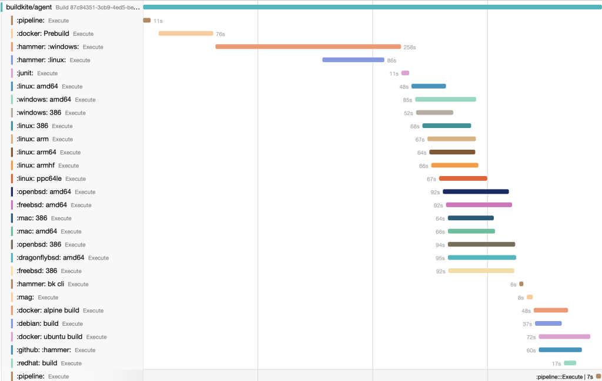

This post is a response/companion to Hazel Weakly's excellent ['Redefining Observability'](https://hazelweakly.me/blog/redefining-observability/). You should probably read it first, and perhaps Fred Hebert's commentary on it, ['A Commentary on Defining Observability'](https://ferd.ca/a-commentary-on-defining-observability.html). I don't necessarily plan on re-treading a lot of the ground that both of them do, and instead, want to focus on breaking down some of the definitions and missing pieces that both present.

<!--more-->

## Definitions Considered Harmful

Hazel and Fred both present several classical and neologistic definitions of observability from control theory, systems engineering, and their own experience in the field. I'm going to toss out another one, because I feel like being contrary, and I'm going to do it from example. Recently, I met with an analyst in the field who brought up a common refrain he heard from leadership in very large organizations. In short, these leaders were sitting down and looking at millions of dollars in annual spend on observability tools, programs, and data with little to show for it -- at least, in their estimation. After all, applications still went down. Their bosses still fielded complaints from sales and marketing teams about reliability, availability, and performance. Investors wanted to know what the organization was doing about costs, and improving margins. Do more with less, forever and ever, until the end of time.

The response of the observability practitioner might be to suggest that these organizations aren't doing observability "right". They simply lack some sort of data, or a particular tool, or some cultural insight -- 'one weird trick', even if that trick amounts to 'just upend the entire way your SDLC works, nbd'. I'm not sure this is a terribly responsible point of view, even if it's hyperbolic. In fact, I think we spend far more time diagnosing why _other_ people are doing observability wrong (or indeed, if they're doing it at all) than the characteristics of _success_ that successful observability practices entail.

If this commentary about 'what went wrong vs. what went right' makes a lightbulb go off over your head, it's probably because you're familiar with the concept of ['Safety-I and Safety-II'](https://psnet.ahrq.gov/issue/safety-i-safety-ii-white-paper). For as much as I like to belabor the point of observability being a way to cope with the concept of highly dynamic systems and the inability of existing methodologies to cope with that (a la Safety I), I'm as guilty as anyone else of ignoring the actual wins that people make with their existing observability practices.

Taking us back to definitions, I think Hazel and Fred are both right on this point. Hazel writes that 'Observability is the process through which one develops the ability to ask meaningful questions, get useful answers, and act effectively on what you learn.' Fred points out that this (and most other) definitions miss out on the notion that observability is self-describing; Sometimes, you just need to know how much gas is in the tank of a car. This is as much a part of an observability system as your ability to understand each relationship between the systems in the car in order to calculate optimal driving speed to efficiently use that gas, not to mention the complex emergent behavior realized by thousands of people solving for these local maximums in their own spheres of influence and making purchasing decisions based on them.

In short, observability _must_ solve for these discrete cases. It needs to be the car dashboard that gives you easy access to critical system state, it needs to be the inquisitive tooling that helps you understand the local system state through rationalization, and it also needs to be the global filter that helps you understand when it's worth stopping for gas in order to save five cents a gallon. We all perform acts of observability every single day in order to accomplish most tasks in our lives, we just don't call it that.

## Success and failure in the garden of observability

I've spent a long time recently thinking about the nature of observability practices, because I think it's obvious that many people do have rather successful ones. What's different, and not measured that well, is how effective those observability practices are relative to other ones. There's a burgeoning language to describe this -- words like 'Observability 1.0' and 'Observability 2.0'. This is where I want to sit for a moment.

Observability 1.0 is not something that everyone has achieved, but it's something that is very achievable today. It is the summation of the past twenty years or so of trends in system design and philosophy -- it combines a variety of telemetry sources (metrics, logs, traces) into specialized tools with pre-defined correlations based on a handful of context values (both 'hard' -- like trace ID, and 'soft' -- like host or pod name), based mostly on existing patterns of operations. Developers write code, add some custom metrics to track important local state, then deploy that code to clusters that are owned and managed by external teams or operators. Those operators enforce some basic standards around data quality and availability, provide canned dashboards and alerts, and work to manage the overall availability of telemetry data as inputs to their alerting pipelines. These alerting pipelines tend to be the main objective of an observability 1.0 practice -- being able to quickly understand if 'something is wrong', ideally with enough context to understand _where_ that something is wrong is an implicit or explicit goal.

While this isn't the stopping point for most organizations, gains after this point tend to be horizontal, rather than vertical. You can get better at certain aspects -- using SLOs, improving your telemetry availability through more advanced sampling, or purchasing tooling that specializes in certain areas of practice like mobile clients or browsers -- but your expenditures don't really scale with the value you get out of the observability system.

I posit that the 'end state' of observability for most organizations looks like a maturity model that turns into a cycle that begins and ends with a question that can be summed up with, "What's wrong?" You stack up enough telemetry data and tools and dashboards until you can answer this question, then you start to cycle through it again while asking more specific questions. I'm reminded of a recent paper by Microsoft on [RCACopilot](https://www.microsoft.com/en-us/research/publication/automatic-root-cause-analysis-via-large-language-models-for-cloud-incidents/), an LLM-based system that automates root cause analysis of incidents by, essentially, looking through thousands of runbooks and following their steps in order to quickly collect data for incidents that look a lot like things they've already seen. It's an impressive tool, and for organizations with sufficient scale and documented knowledge, is certainly valuable.

The problem with this cycle is that it's limiting. To quote Hazel, "We completely and utterly fucked it up by defining observability to mean 'gigachad-scale JSON logs parser with a fancy search engine.'"

## Breaking the cycle

I don't want to endlessly echo the points Hazel makes here, but I do want to refine them. Her tl;dr is that observability _should_ look a lot more like BI (business intelligence) than it currently does. I completely agree! The fundamental flaw that I've found in this space over the past few years of watching talks, reading about it, and participating in OpenTelemetry is that we're utterly captured by a complete and total lack of creative thinking. Observability as its currently practiced seems like an exercise in showing off our QPS by way of accurate histogram bucketing, rather than stepping back and thinking for a second about how the hell our business makes _money_.

Even if you've calculated the cost of downtime, you probably aren't really thinking about the relationship between telemetry data and business data. Engineering stuff tends to stay in the engineering domain. Here's some questions that I'd suggest most people can't answer with their observability programs, but are _absolutely fucking fascinating questions:_

- What's the relationship between system performance and conversions, by funnel stage? Break it down by geo, device, and intent signals.

- What's our cost of goods sold per request, per customer, with real-time pricing data of resources?

- How much does each marginal API request to our enterprise data endpoint cost in terms of availability for lower-tiered customers? Enough to justify automation work?

- We need to be in compliance with new emissions regulations for cloud workloads, but the penalties are assessed on rolling 24-hour windows by DC. Where can we afford to time and location shift work in order to avoid paying penalties?

- What libraries and dependencies are causing the most incidents? Which teams are responsible for maintaining them?

- How much time are we spending on database migrations by team and product line? Which are the most risky, and which are the safest? Is it because of the people, or the tech?

- Who's our most efficient on-call engineer, and what are they doing with the tools that makes them that way?

- Can we quantify how much we're really saving on the cloud versus on-prem for these workloads?

- Which teams are responsible for breaking prod the most? Which are breaking it the least? Don't just show it via deployment data, do a multi-dimensional comparison against tenure, rate of changes landed in prod, and incident resolution.

These are all, fundamentally, _observability questions_. "What endpoint is slow", or "Are 99.995% of transactions on this API successful" are _boring observability questions_. They're observability 1.0 questions. The real problem is, most people don't know (or think to ask) the good ones because they don't see a way to ever ask them! The tragedy is that, by and large, _the data already exists, but we don't put it together._

The first step to break this cycle is to first define the questions you want to ask. Don't limit yourself to the basic ones -- the fuel gage should be included on a car, after all -- ask the big ones. These might not be achievable tomorrow, but unless you've defined what classes of questions you want to ask, and how those questions are connected to your business goals, you're going to spin forever on the simple stuff.

The second part of the cycle to break has to do with the data itself.

## If You Say Pillar One More Time...

Here's a fun story about OpenTelemetry. Did you know that OpenTelemetry treats _everything_ as an event? It doesn't know what a span, or a log is, deep down. Everything that happens is simply an event. A record. A signal that 'hey, a thing happened'. If you bring up that we actually have, uh, four different things that are called 'events' I will glare at you.

But, yeah, events. What happens to an event when it happens? Well, we add _semantics_ to those events. More accurately, _you_ do. When you create a span, a log, a metric instrument, or whatever -- you're telling OpenTelemetry how to interpret that event. This semantic telemetry is then enhanced with other semantically useful metadata -- resources, that tell you where it emanated from. Attributes, that provide dimensions for querying and aggregation. Context, that binds all of it together in a single, correlated braid.

Then you send it off to a backend who throws like 99% of that away and treats it like an undifferentiated point. Some of that's on you -- gotta control cardinality! -- but ultimately your choice of data storage and query layer has a lot more to do with how you interact with telemetry data than the actual data itself. I, personally, think this is a mistake. Admittedly, this is a mistake I don't necessarily have a pat answer for, but I have some general ideas.

We focus a lot on the types of telemetry, but it's actually a lot less important than you think. Telemetry can be transformed, usually in a non-lossy way, from rest. It's actually ridiculously inexpensive to just put... like, all your telemetry data in blob storage. Like, rounding error inexpensive. 500TB of telemetry in S3 is something like 10k a month. Do you need to keep over 500TB of telemetry data a month? Want to query it? Cool, use Athena or something. New Relic charges like fifty cents a gig over 100GB. That's orders of magnitude difference! Literally every other option is more expensive than 'throw it all in S3 and age it out after 30 days'. The problem is that we tend to conflate 'telemetry' with 'observability', and when we say 'observability' what we're usually talking about are 'workflows'.

A workflow is what it says on the tin. It's a mechanical action you perform in order to accomplish a task. It's APM, it's search, it's viewing a dashboard, it's writing a query. When I say 'tracing', most people probably think of something like a trace waterfall. When I say 'metrics', they think of a time series plot. This is a somewhat useful abstraction and model, but it's kind of a thought-terminating cliche.

<figure>

<figcaption>

_This is what 'tracing' brings to mind, right?_

</figcaption>

</figure>

The reason this model isn't helpful is because it's limiting. It couples your mental model of the underlying data type to the workflows you use it for, and the projections you make from the data. A trace can only be this, a series of events that occur in order, all relating to a single logical transaction. You use this to view single, logical transactions. That's all you can do with it! The model and semantics act as a constraint -- which, admittedly, isn't _the worst thing_. Why do most logs suck? Because they're freeform, you can do whatever. You write them for you, not for systems. Flip it around, and what's a trace? It's a bunch of log messages with a defined schema. It's an event with some semantic sugar on it.

Metrics, fundamentally, same problem. It's an event that you compress ahead of time because it's more efficient. Lots of events in the world are useful to think about as numbers with attributes. You're making a tradeoff between write time and read time semantics. There's nothing special about a metric, or even an individual measurement, that makes it inviolate. Heck, most of the time people aren't even doing that much interesting with them. I would suggest that the vast majority of metrics that people use are instantaneous measurements - counters or gauges; 'how much gas do I have right now', 'what's my current speed', etc.

I'm not saying these measurements or visualizations are worthless, mind you. They're extremely valuable as part of monitoring what your application is doing. Collecting, indexing, and presenting this data to developers and operators is crucial. **We already have a word for this, it's 'monitoring'.**

## The Great Observability Bait And Switch

Hazel correctly identifies this in her piece - observability is being sold to infrastructure teams, and this buries the idea by conflating the implementation with the practice. This is, perhaps, a symptom of great marketing by vendors in the space, but I also tend to think that it's a byproduct of the sort of [professionalization crisis](https://aparker.io/2020/12/the-commodification-of-devops/) I wrote about a few years ago. Monitoring sounds boring, that's an IT thing. We're SRE's and DevOps, we need _observability_.

The problem with this is that we've slapped a new coat of paint on some old ideas and dolled it up with a bit of context without actually trying to step outside our problem domain. I don't necessarily think this is a deliberate act, I would hazard a guess that it's just how organizations function. How many engineering leaders do you know that have MBAs? The fact is, engineering is siloed off for many reasons. Some of those reasons are good -- R&D, as a class of work, _is_ a creative endeavor. Some of them, though, are bad. Arrogance on both sides of the equation, organizational leadership beholden to shareholders that view engineering as a cost center and engineering leadership that are too frazzled by shifting demands and cost-cutting to create holistic approaches to product and feature delivery. When I talk to people in industry at a leadership level, the only question they really have is "how do I save money" these days. We can all bemoan the end of ZIRP, but it's probably worthwhile to ask why we single out engineering as the fun times free money zone. The overwhelming majority of businesses on the planet don't get to figure out COGS as a year five, seven, or twelve problem. If you're selling pizzas for less than it costs you to make them, you go out of business very very quickly.

On the flip side, most organizations spend an awful lot of money and time on a fleet of business analysts and business intelligence tools in order to ask questions, forecast future results, and manage the reams of telemetry data they get about the organization itself. These are mundane questions, to be sure -- spot the outlier in spend in this department on T&E, calculate CAC over time, figure up the ROI on capital improvements, spot trends in sales in order to rebalance staffing levels in field teams. I don't want to sit here and rank the value of these questions, but I want to point something out -- **pretty much everything in business is about asking questions and forming hypotheses, then testing them.**

Wait, isn't that just observability? Why yes, it is! This is what we've been preaching for years now, and it's mostly gotten yoinked out from under us in favor of endless discussions and micro-optimizations about data storage, query languages, telemetry types, and so forth. The opportunity isn't "let's get really good at figuring out when the Kubernetes cluster is going to have problems", it's "let's combine these telemetry streams so we can quantify our investment in reliability based on actual user experience".

Hazel writes more about this using more words (seriously, go read the posts) but I think this part bears repeating:

> Learning, without action, isn't learning; it's fundamentally a process. And processes? Processes are messy, they require action, they require movement, they require _doing,_ the require re-evaluating the process, they require evolving the process, they require wrangling with the human condition itself.

Observability has been buried in so many layers of indirection that the fundamental cycle of _doing_ it is indecipherable. It's an oroborous; The factory grows to meet the needs of the growing factory. We don't need a reset, we need a reorientation.

## Towards Observability 2.0

What does it look like to re-orient ourselves? I think it's worthwhile to mention that this isn't some completely new and uncharted territory. There's organizations that are walking this path today - Meta, Netflix, sure. There's also smaller ones -- Honeycomb is on this path, I think. Lightstep was, at one point. Fundamentally, it's about treating observability as an organizational muscle, not just an engineering one. It's about connecting vast and discrete forms of telemetry together through schemas and semantic conventions, allowing anyone in the business to ask questions, build hypotheses, and access the data they need to prove or disprove them. It's about the ability of the organization itself to respond to this data, to synthesize the gut feelings that drive decisions with the hard facts about measurable reality in order to _do_, to _go_, and to do it all _safely_.

Observability 2.0 is less concerned with the type of telemetry you use and collect, and more concerned with its structure and schema. It's less concerned with where you store that data, and more concerned with how accessible the data is. It's less concerned with gigachad JSON search indexes, and more concerned with flexibility and query-time aggregations. It's less concerned with 'saving money' and more concerned with 'providing value'.

This last point I think is crucial. This shit costs money, sure. Everything does. The difference is how these costs scale. Monitoring costs are exponential, since every additional byte of unneeded telemetry acts as a drag by increasing noise. Observability 2.0 argues that there _is_ no unneeded telemetry. Every event has value, it's just about where you extract it. Rather than duplicating data at write-time based on type, layer your telemetry and pass it through samplers to store the right stuff in the right place in the right way. Use the fact that most of the things you're measuring are instantaneous to put metrics-like measurements on other structured outputs. Keep more metrics than you do today, for longer than you do today, but compress them more by leveraging exemplars to offload high-cardinality metadata to other formats. Create schemas for business data and tie it in to your performance telemetry, then query across both. Embed sales and marketing in your engineering groups, and vice-versa. The C-Suite and your engineers should be looking at the same SLOs on the same dashboards. Add attributes that map to your issue management system in code. Add attributes that map to teams! Put the Slack handle of who's on-call in your traces, then hook it up to PagerDuty to change along with the schedule. Record events, record a lot of events. Make time and space for asking questions. There's no such thing as a bad question.

Now, more than ever, we have the tools we need in order to build this kind of observability practice. It is incumbent on us to pick up those tools and carry them into the future, to build a better tomorrow, than we have today.
